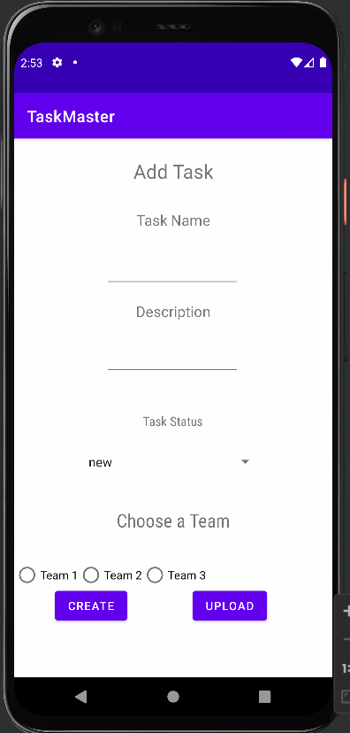
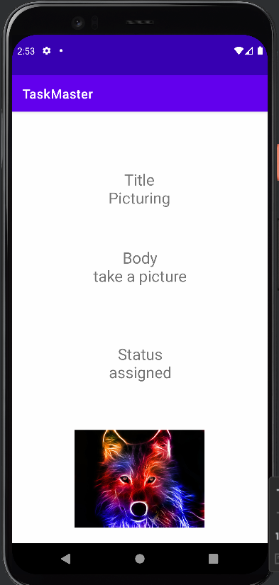

# Lab: 37 - S3  

In this lab I added an upload button to add task form, the user can upload photos to the AmazonS3.  
On the Task detail activity, the user can see an image associated with the task, that image should be displayed within that activity.  

  
  
