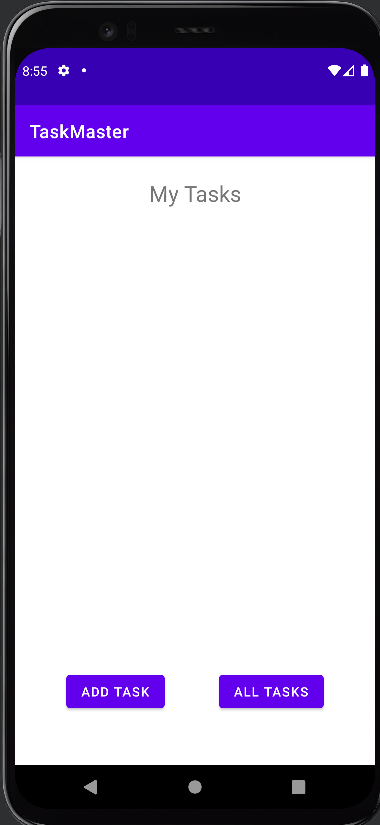
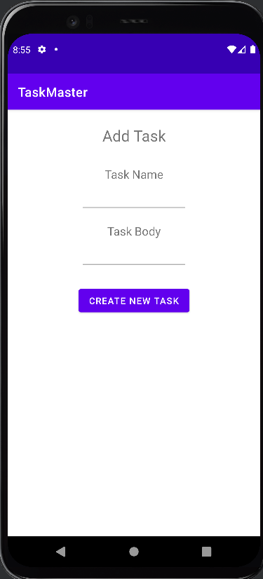
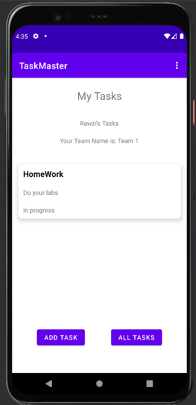
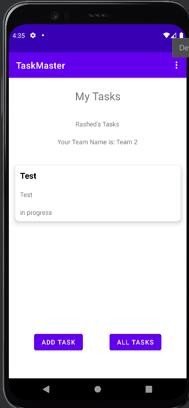
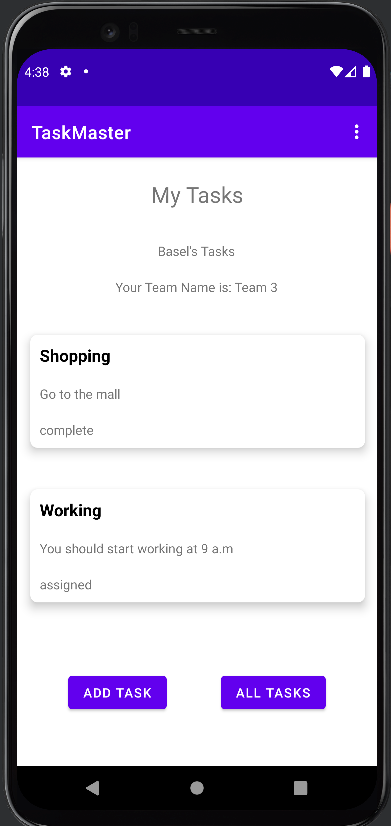

# Taskmaster  
This android application can be used to handle tasks.  

# ScreenShots

  

  

  

# Lab33: Related Data  

In this lab I created a second entity for a team, which has a name and a list of tasks. and I did relations between Task and Team models to assign a bunch of tasks for each team in my application.  

  

  

  

# Lab34: Publishing to the Play Store  

How to create a developer account: 

1- You should visit "https://play.google.com/console/signup/playSignup".  
2- then you choose "Yourself" choice, for personal use.  
3- Then you should fill out the application:  

- Developer name
- Contact name
- Contact email address
- Contact address
- Contact phone number
- Website "Enter the url of your website or social media profile"

after that you should specify your card information to pay.
